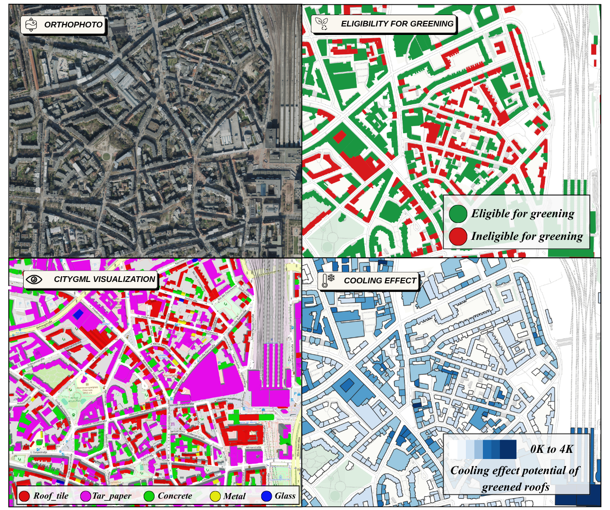

# Roof material classification and green-roof cooling scenarios

[](https://doi.org/10.1016/j.scs.2026.107734)
[](https://doi.org/10.1016/j.scs.2026.107734)

Code for the article
**[Semantic enrichment of 3D city models via roof material classification for urban greening and heat island mitigation](https://www.sciencedirect.com/science/article/pii/S2210670726006177)**
(Sustainable Cities and Society, 149, 2026, 107734).



End-to-end code for the study: predict **roof material composition** from
high-resolution aerial imagery, write it onto **CityGML / LoD2 building
footprints**, and use the enriched footprints to model how **green-roof
retrofits would change land surface temperature (LST)**.

The repository has two parts that are meant to be run in sequence:

| Part | Folder | What it does |
| --- | --- | --- |
| **1. Roof material classification** | `scripts/` | orthophoto + footprints -> per-building material composition (GeoJSON) |
| **2. Green-roof LST scenario** | `green_roof_scenario/` | enriched footprints + Landsat scene -> modelled cooling per building and per pixel |

Material classes: `concrete`, `glass`, `metal`, `roof_tiles`, `tar_paper`.

> **No data is shipped with this repository.** Every script takes its inputs as
> command-line arguments. Link your own orthophotos, your own building
> footprints, your own Landsat scene and your own model checkpoint. All paths in
> the examples below are placeholders.

---

## Full pipeline

```
PART 1 - roof material classification
  A. training data          B. training                 C. inference
  OSM roof:material tags    detection -> classification your orthophoto tiles
  + your WMS crops                 |                           |
          v                        v                           v
  footprint-masked chips     class balancing            mosaic -> patches -> chips
                                   |                           |
                                   v                           v
                            YOLO11-cls fine-tune  ->  best.pt -> grid-refined prediction
                                                                        |
                                                                        v
                                              footprints + predicted_roof_materials
                                                          (GeoJSON)
                                                                        |
PART 2 - green-roof cooling scenario                                    |
  Landsat 8/9 C2 L2 scene ------------------------------+---------------+
                                                        v
                       NDVI / albedo / NDBI -> RF or linear fit against observed LST
                                                        v
                       predictors blended toward green-roof targets over selected roofs
                                                        v
                       delta_LST raster + per-building cooling statistics
```

## Repository layout

```
scripts/                              PART 1
  data/    fetch_osm_roof_crops.py            training crops from OSM + your WMS
           worldfile_to_geotiff.py            .jpg + .jgw  ->  GeoTIFF
           mask_crops_by_osm_footprint.py     blacken everything outside the roof
  train/   build_classification_dataset.py    detection layout -> classification layout
           balance_classes_by_oversampling.py oversample under-represented materials
           train_material_classifier.py       YOLO11-cls fine-tuning
  infer/   tile_orthophoto.py                 mosaic + fixed-size patches
           mask_chips_by_footprint.py         one masked chip per building
           predict_roof_materials.py          prediction -> enriched GeoJSON
           add_dominant_material.py           optional scalar dominant_material field
configs/   material.example.yaml              class order (must match the weights)
examples/  run_full_pipeline.sh               batch runner, one config block to edit
weights/   README.md                          where to put best.pt
CITATION.cff                                  machine-readable citation metadata

green_roof_scenario/                  PART 2 (installable package, own readme)
  src/green_roof_scenario/            scenario, modelling, masking, CLI
  tests/                              synthetic-data test suite
```

## Requirements

Python >= 3.10 for both parts. They have different dependency sets, so a single
environment is possible but two are cleaner.

```bash
# Part 1
python -m venv .venv && source .venv/bin/activate
pip install -r requirements.txt

# Part 2 (from the repository root)
pip install -e ./green_roof_scenario
green-roof-scenario --help
```

`green_roof_scenario` also ships a `uv.lock`, which is the reproducible route:

```bash
cd green_roof_scenario
uv sync
uv run green-roof-scenario --help
```

Both parts need a working GDAL/PROJ stack for `rasterio`/`geopandas`/`pyproj`.
If PROJ complains about a `proj.db` version conflict, a Conda installation is
usually leaking paths into the active environment; deactivate Conda and unset
`PROJ_DATA PROJ_LIB GDAL_DATA GDAL_DRIVER_PATH`.

## Data you have to provide

| What | Used by | Notes |
| --- | --- | --- |
| Orthophoto WMS endpoint + layer | `fetch_osm_roof_crops.py` | any service you are licensed to use |
| Orthophoto tiles (GeoTIFF) of your AOI | `tile_orthophoto.py` | inference input |
| Building footprints (GeoJSON) | `mask_chips_by_footprint.py`, `predict_roof_materials.py` | **same CRS as the imagery**, e.g. EPSG:25832; a `gml_id` property is used as the building key |
| Model checkpoint (`best.pt`) | `predict_roof_materials.py` | see `weights/README.md` |
| Landsat 8/9 Collection 2 Level-2 scene | `green-roof-scenario` | one scene folder with `ST_B10`, `QA_PIXEL`, `SR_B2/B4/B5/B6/B7` |
| CityGML LoD2 files | `green-roof-enrich-slopes` | optional, for the roof-slope filter |

**Where do I put my own links?** Every script takes its inputs as command-line
arguments and refuses to guess. If you prefer one place to edit, open
[`examples/run_full_pipeline.sh`](examples/run_full_pipeline.sh): it has a single
configuration block at the top where you enter your paths, endpoint and target
values, and it then runs stages 7 to 13 end to end.

---

# Part 1 - roof material classification

## A. Building the training data

```bash
# 1) stream one georeferenced crop per OSM building that carries both tags
python scripts/data/fetch_osm_roof_crops.py \
  --city mycity \
  --bbox <MINLON> <MINLAT> <MAXLON> <MAXLAT> \
  --wms_url  "<YOUR_ORTHOPHOTO_WMS_ENDPOINT>" \
  --wms_layer "<YOUR_WMS_LAYER>" \
  --out_images data/crops/mycity_images \
  --out_meta   data/crops/meta/crops_meta_mycity.csv \
  --ground_size_m 100 \
  --pad_frac 0.10 \
  --min_distance 50

# 2) attach the CRS: .jpg + .jgw  ->  GeoTIFF
python scripts/data/worldfile_to_geotiff.py \
  --in      data/crops/mycity_images \
  --out_dir data/crops/mycity_geotiff \
  --crs     EPSG:3857

# 3) keep roof pixels only
python scripts/data/mask_crops_by_osm_footprint.py \
  --images_dir        data/crops/mycity_geotiff \
  --meta_csv          data/crops/meta/crops_meta_mycity.csv \
  --buildings_geojson data/raw/buildings_mycity.geojson \
  --out_dir           data/masked/mycity \
  --out_ext           png \
  --alpha_outside
```

Stage 1 caches the Overpass result in `data/raw/buildings_<city>.geojson` and
reuses it on the next run. Delete that file to force a refetch.

## B. Training

```bash
# 4) detection layout -> classification folders (class names come from the yaml)
python scripts/train/build_classification_dataset.py \
  --det_root <PATH_TO_YOUR_DETECTION_DATASET> \
  --out_root dataset_cls/material \
  --yaml     configs/material.example.yaml

# 5) balance the train split (val/test are copied untouched)
python scripts/train/balance_classes_by_oversampling.py \
  --in_root  dataset_cls/material \
  --out_root dataset_cls/material_bal \
  --target_per_class 12000

# 6) fine-tune YOLO11-cls
python scripts/train/train_material_classifier.py \
  --data    dataset_cls/material_bal \
  --model   yolo11l-cls.pt \
  --imgsz   512 \
  --epochs  100 \
  --batch   32 \
  --device  0 \
  --project <YOUR_RUNS_DIR> \
  --name    material_cls_s512_12k_bal
```

The defaults of stage 6 are the settings used for the released checkpoint
(imgsz 512, 100 epochs, batch 32, patience 20, `fliplr 0.5`, `degrees 5`,
`scale 0.10`, `label_smoothing 0.05`). Copy `best.pt` into `weights/`.

## C. Inference on a new city

```bash
# 7) mosaic your orthophoto tiles and cut 500x500 px patches (100x100 m at 0.20 m/px)
python scripts/infer/tile_orthophoto.py \
  --in_dir  <PATH_TO_YOUR_ORTHOPHOTO_TILES> \
  --out_dir patches/mycity

# 8) one footprint-masked GeoTIFF chip per building
python scripts/infer/mask_chips_by_footprint.py \
  --dir        patches/mycity \
  --out_dir    chips/mycity \
  --footprints <PATH_TO_YOUR_FOOTPRINTS>.geojson \
  --min_px     100 \
  --dilate_px  2

# 9) predict and enrich the footprints
python scripts/infer/predict_roof_materials.py \
  --weights      weights/best.pt \
  --chips_dir    chips/mycity \
  --footprints   <PATH_TO_YOUR_FOOTPRINTS>.geojson \
  --out_geojson  mycity_roof_materials.geojson \
  --device       mps \
  --dst_epsg     25832 \
  --tile 192 --stride 96 --pad 32 \
  --patch_min_roof_cov 0.55 \
  --nondefault_min_conf 0.6 \
  --margin_over_default 0.05 \
  --min_island_px 100 \
  --min_cov_frac 0.02 \
  --max_materials 5 \
  --min_px 100 \
  --min_iou 0.1
```

`--min_px` in stage 8 controls how small a building may be to still get a chip;
200-250 is a reasonable value for dense historic centres, 100 keeps more small
outbuildings. Use `--device cuda` on NVIDIA, `--device mps` on Apple silicon,
`--device cpu` otherwise.

### Output format

`predict_roof_materials.py` writes a `FeatureCollection` in which every feature
keeps its **original footprint geometry and properties** and gains:

| Property | Type | Meaning |
| --- | --- | --- |
| `predicted_roof_materials` | list of strings | material ids, dominant first |
| `material_cov` | list of floats | fraction of roof pixels per material, same order |

Material ids follow the `TARGET_ID` mapping at the top of the script:

| id | material |
| --- | --- |
| 0 | concrete |
| 1 | metal |
| 2 | glass |
| 3 | roof_tiles |
| 4 | tar_paper |

### How the prediction works

1. One whole-roof prediction gives the default class for the building.
2. A sliding window (`--tile`, `--stride`, `--pad`) reclassifies each roof
   region; a tile only overrides the default when it is confident enough
   (`--nondefault_min_conf`) **and** clearly beats the default
   (`--margin_over_default`).
3. Non-default regions smaller than `--min_island_px` are reverted.
4. An orientation-aware majority filter smooths along the roof main axis.
5. Coverage fractions are computed per material; secondary materials must pass
   both an absolute and a relative threshold to be reported.
6. The vectorised roof mask is matched to a footprint by IoU (`--min_iou`); per
   `gml_id`, the chip with the most roof pixels wins.


---

# Part 2 - green-roof cooling scenario

`green_roof_scenario/` is a self-contained Python package with its own CLI,
tests and documentation. Read
[`green_roof_scenario/readme.md`](green_roof_scenario/readme.md) for the full
option list.

In short, it derives NDVI, broadband albedo and NDBI from a Landsat 8/9
Collection 2 Level-2 scene, fits an empirical model (Random Forest by default)
against observed LST, blends the predictors toward green-roof target values over
the *selected* roofs only, and reports

```
delta_LST = modelled_scenario_LST - modelled_baseline_LST
```

as a raster plus per-building statistics. Negative values are cooling. It is an
empirical scenario tool, not a physical urban-climate model.

## Bridging Part 1 into Part 2

The material codes line up by construction: the scenario runs select
`--roof_materials_type "0,4"`, i.e. **concrete and tar paper**, which are exactly
ids 0 and 4 of the `TARGET_ID` table above. Those are the flat, dark, high-uptake
roofs that are plausible greening candidates.

The enriched GeoJSON from stage 9 can be passed straight in, because the
selection filter takes the first entry of a list-valued attribute, which is the
dominant material:

```bash
green-roof-scenario \
  --l2_folder  <PATH_TO_YOUR_LANDSAT_L2_SCENE_FOLDER> \
  --buildings  mycity_roof_materials.geojson \
  --roof_material_field predicted_roof_materials \
  --roof_materials_type "0,4" \
  --out_dir    outputs/scenarios/mycity \
  --build_lst \
  --model rf \
  --target_ndvi   <FROM_green-roof-params> \
  --target_ndbi   <FROM_green-roof-params> \
  --target_albedo <FROM_green-roof-params> \
  --clip_positive_delta \
  --write_indices_rasters
```

If you would rather filter on a plain scalar column (easier to style in QGIS),
add one first:

```bash
python scripts/infer/add_dominant_material.py \
  --in_geojson  mycity_roof_materials.geojson \
  --out_geojson mycity_roof_materials_dominant.geojson

# then: --roof_material_field dominant_material --roof_materials_type "0,4"
```

To hand over a GeoPackage instead of GeoJSON (both are accepted), use GDAL:

```bash
ogr2ogr -f GPKG mycity_buildings.gpkg mycity_roof_materials_dominant.geojson -nln buildings
```

### Recommended order for a new city

1. Stages 7-9 above -> `mycity_roof_materials.geojson`
2. `green-roof-fetch-osm` -> known green roofs inside the same extent
3. `green-roof-params` -> local NDVI / NDBI / albedo targets from those roofs
4. `green-roof-enrich-slopes` (optional) -> `roof_slope_mean_deg` from CityGML LoD2,
   so the scenario can additionally require a low slope, e.g.
   `--roof_slope_field roof_slope_mean_deg --max_roof_slope_deg 15`
5. `green-roof-scenario` -> `delta_LST.tif`, `scenario_pred_LST.tif`,
   `buildings_greening_impact.gpkg` and the statistics/provenance text files

Green-roof targets are city-specific and should come from comparable local roofs
in the **same** acquisition. Do not reuse another city's targets.

---

## Citation

If you use this code, please cite the accompanying article:

```bibtex
@article{roofmats2026,
  title   = {Semantic enrichment of 3D city models via roof material classification for urban greening and heat island mitigation},
  journal = {Sustainable Cities and Society},
  volume  = {149},
  pages   = {107734},
  year    = {2026},
  issn    = {2210-6707},
  doi     = {https://doi.org/10.1016/j.scs.2026.107734},
  url     = {https://www.sciencedirect.com/science/article/pii/S2210670726006177},
  author  = {Elmehdi Kanna and Jannik Matijevic and Lukas Arzoumanidis and Huynh Duc An Son Nguyen and Youness Dehbi}
}
```
